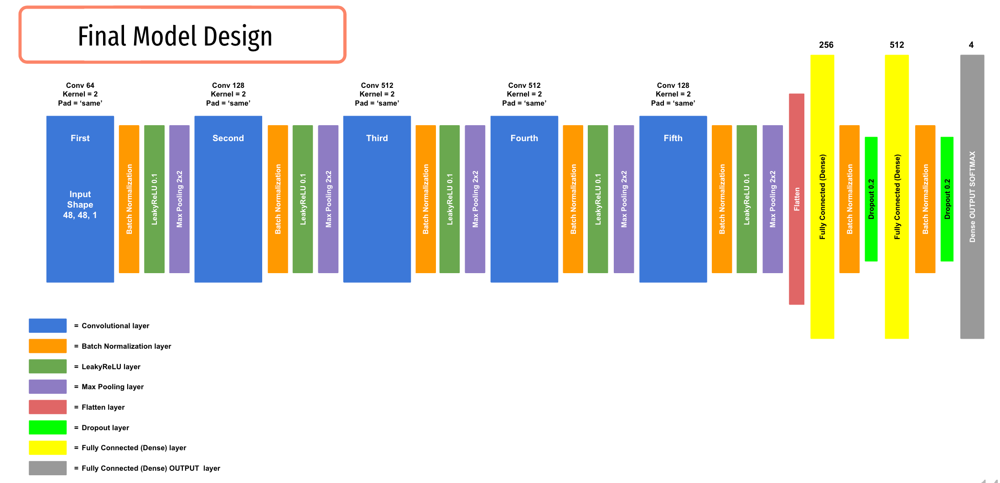

<h1 align="center">Data Science Portfolio</h1>

## [Capstone Project - Deep Learning Methods for Facial Emotion Recognition](https://github.com/MPBDS2022/Data-Science/tree/main/capstone)
 

 

------
**Additional projects that will be uploaded shortly:**
- Exploratory Data Analysis
- Principal Component Analysis
- Clustering Analysis

---------

<h3 align="left">Languages and Tools used throughout:</h3> 

               
 

-------
## Connect with me:
- email: nika.boyce@gmail.com

- 
