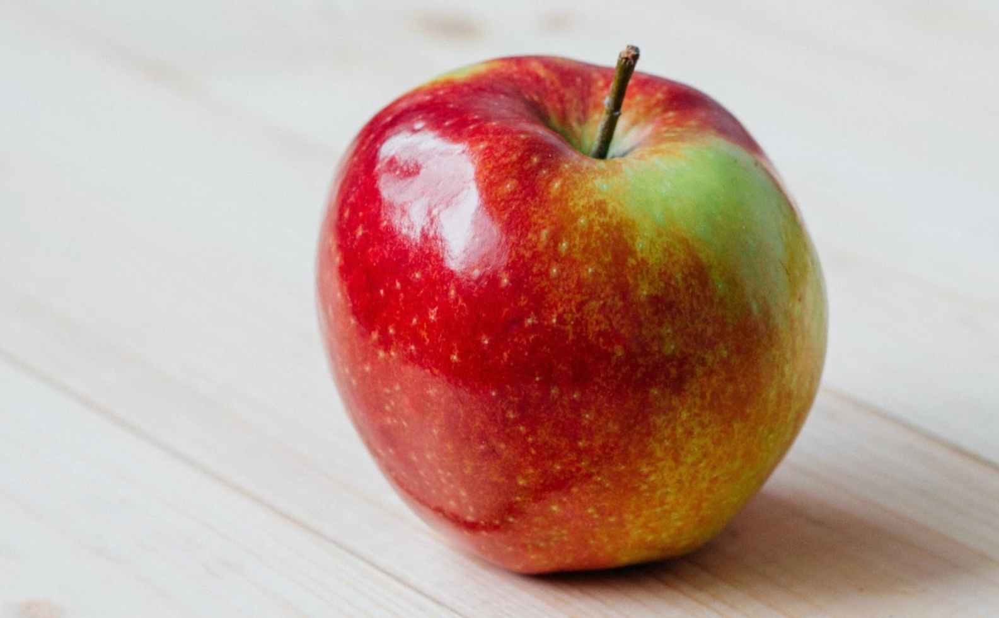
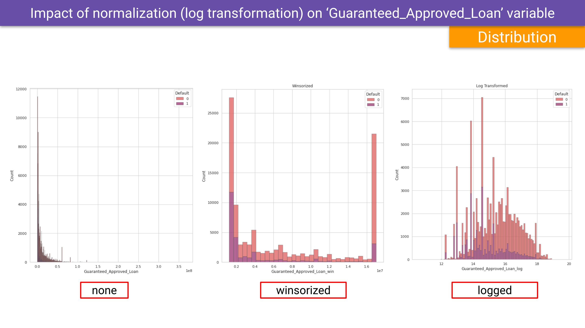
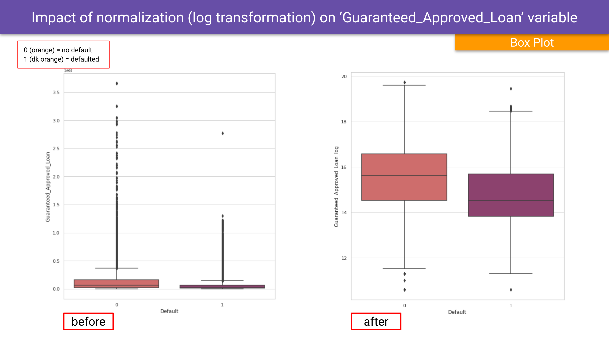

# **Data Preparation**

This and other projects can be found at my Data Science Project Portfolio site <a href="https://www.monicaboyce.com">MonicaBoyce.com</a>

 

---

Every data science endeavor begins with source data that will hopefully provide insights on a question (business, technical, scientific, etc). Each data set will present with its own characteristic data quality issues that must be identified, characterized, and (if problematic) corrected or mitigated.

## **Project Objective**

The objective of this project is to showcase various methods that can be used in data preparation to yield a data set that can be effectively analyzed and, if desired, used to train machine learning models.  

---

## **Project files include:**

- These Google slides ([slides PDF](https://github.com/MPBDS2022/Data-Science/tree/main/clean/JUST_clean_data_project.pdf)) will step you through the various steps in preparing a challenging dataset for statistical analysis and use in machine learning (shown in a [separate project](https://github.com/MPBDS2022/Data-Science/tree/main/ML/code/placeholder.ipynb)).

- The code that I created for this data preparation project can be found in this jupyter notebook [here](https://github.com/MPBDS2022/Data-Science/tree/main/clean/code/data_prep_portfolio_FINAL_4_github.ipynb)

---
## Data Preparation Methods

- Data Quality Assessment
  - Create DataFrame from CSV data and navigate through the unprocessed data to begin to identify data issues
  - Check for accuracy, completeness, consistency, etc
- Data Pre-Processing
  - Cleaning, transforming, and possibly reducing the complexity of data
    - Correct spelling and naming format issues
    - Drop unnecessary columns
    - Check and fix datatypes for correct format
    - Clean up monetary data to be integers versus heterogenous string+int
    - Check for Missing Data
    - Encode categorical variables
      - Identify categories by looking for unique values
      - Implement a nominal encoding scheme
    - Outliers
- Tech Stack [shown below](#the-tech-stack)

### **Sample outcomes**

Throughout the notebook and slides shared above you will see a progression from raw data to data that has been cleaned and prepared from statistical analysis and machine learning.

Below are a couple screenshots of data before and after the cleaning methods.

---

## **The Tech Stack**

- <a href="https://www.python.org" target="_blank" rel="noreferrer">Python</a>
- <a href="https://numpy.org/" target="_blank" rel="noreferrer">Numpy</a>
- <a href="https://matplotlib.org/" target="_blank" rel="noreferrer">matplotlib</a>
- <a href="https://matplotlib.org/stable/tutorials/introductory/pyplot.html">PyPlot</a>
- <a href="https://pandas.pydata.org/" target="_blank" rel="noreferrer">Pandas</a>
- <a href="https://seaborn.pydata.org/" target="_blank" rel="noreferrer">Seaborn</a>
- <a href="https://scikit-learn.org/" target="_blank" rel="noreferrer">Scikit Learn</a>
- <a href="https://scipy.org/">SciPy</a>
- <a href="https://pypi.org/project/parquet/">parquet</a>

---

## Connect with me

- Data Science Project Portfolio site -  <a href="https://www.monicaboyce.com">MonicaBoyce.com</a>

- email: nika.boyce@gmail.com

- 

---

<h3 align="left">Languages and Tools used throughout my portfolio projects:</h3> 

               
 