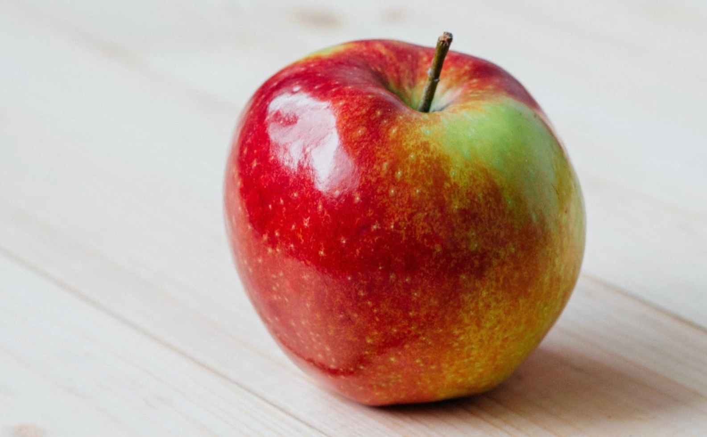

# **Data Preparation** 

---

---

## **Executive Summary**

###    Every data science endeavor begins with source data that will hopefully provide insights on a question (business, technical, scientific, etc). Each data set will present with its own characteristic data quality issues that must be identified, characterized, and (if problematic) corrected or mitigated.
###    The objective of data preparation is to yield a data set that can be effectively analyzed and, if desired, used as a training resource to make predictions with machine learning methods.  
###  The Google slides shown below will step you through the various steps in preparing a challenging dataset for statistical analysis and use in machine learning (shown on a separate page LINK HERE).  
###  Below these slides you will find links to the GitHub repo that holds the python code (in notebook format) used in this project.

---

<!-- this is the embed code provided by Google -->
<iframe style="position: absolute; top: 0; left: 0; width: 100%; height: 100%;" src="https://docs.google.com/presentation/d/e/2PACX-1vQqq8giI5wkEmAxf2gZLHVq5guuubXCUNrXxA1k2z23sdNCqEjKHQ1WQcjR4IIkHQ-wV8-OMUhh5qvQ/embed?start=false&loop=false&delayms=60000" frameborder="0" allowfullscreen="true" mozallowfullscreen="true" webkitallowfullscreen="true"></iframe>
<!-- Google embed ends -->

------
## **Project files include:**

- <a href="https://github.com/MPBDS2022/Data-Science/blob/main/capstone/MPB_capstone_presentation.pdf">Slide presentation</a> for this capstone project. This was presented live before a panel of program evaluators. Provided here as a PDF.
  - Related jupyter notebook
    - <a href="https://github.com/MPBDS2022/Data-Science/blob/main/capstone/MPB_capstone_code.ipynb">Final code submitted for this project</a>

- <a href="https://github.com/MPBDS2022/Data-Science/blob/main/capstone/NEW_MPB_PRESENTATION_CAPSTONE.pdf">UPDATED Slide presentation on Transfer Learning Model Optimization</a>. Since the completion of this course, I have gone back and examined issues I had with the transfer learning aspects of this project. Please see these slides for a treatment on what I have learned. Provided here as a PDF.
  - Related jupyter notebooks:
    - <a href="https://github.com/MPBDS2022/Data-Science/blob/main/capstone/VGG16_modded_CAPSTONE.ipynb">VGG16 optimization</a>
    - <a href="https://github.com/MPBDS2022/Data-Science/blob/main/capstone/RESNET_modded_CAPSTONE.ipynb">ResNet101 optimization</a>
    - <a href="https://github.com/MPBDS2022/Data-Science/blob/main/capstone/EFFICIENTNET_modded_CAPSTONE.ipynb">EfficientNet B2 optimization</a>

- The <a href="https://github.com/MPBDS2022/Data-Science/blob/main/capstone/MPB-capstone-REPORT.pdf">Capstone Final Report</a>. This concise 9 page report includes:
  - Executive Summary 
  - Problem Summary
  - Solution Design
  - Analysis and Key Insights
  - Key Limitations
  - Key Recommendations for Further Analysis and Implementation
  - Bibliography

-  <a href="https://github.com/MPBDS2022/Data-Science/blob/main/capstone/MPB_capstone_code.ipynb">Convolutional Neural Network model build and performance testing code</a>
-------
## **The Tech Stack for this project includes:**

- <a href="https://www.python.org" target="_blank" rel="noreferrer">Python</a>
- <a href="https://numpy.org/" target="_blank" rel="noreferrer">Numpy</a>
- <a href="https://matplotlib.org/" target="_blank" rel="noreferrer">matplotlib</a>
- <a href="https://pandas.pydata.org/" target="_blank" rel="noreferrer">Pandas</a>
- <a href="https://seaborn.pydata.org/" target="_blank" rel="noreferrer">Seaborn</a>
- <a href="https://scikit-learn.org/" target="_blank" rel="noreferrer">Scikit Learn</a>
- <a href="https://www.tensorflow.org" target="_blank" rel="noreferrer">TensorFlow</a>
- <a href="https://keras.io/" target="_blank" rel="noreferrer">Keras</a>

-------
## Connect with me:
- email: nika.boyce@gmail.com

- 

